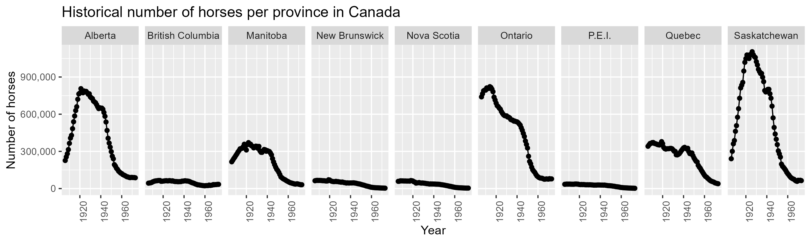
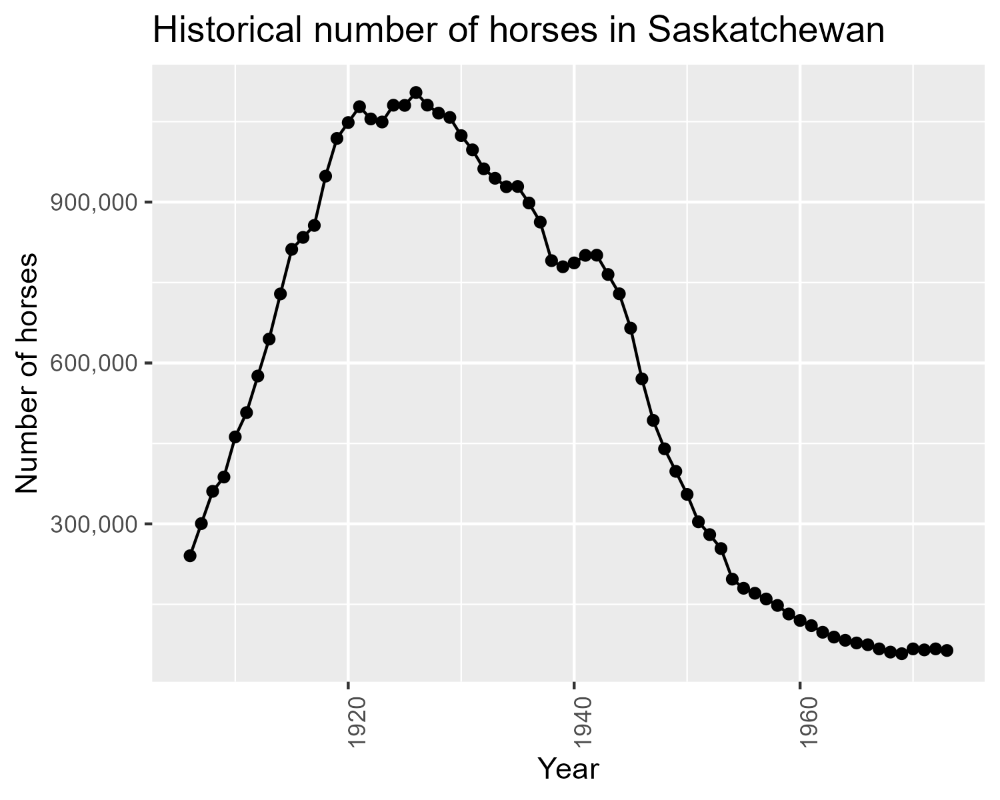

::: {.cell}

:::

## Aim

This project explores the historical population of horses in Canada 
between 1906 and 1972 for each province.

## Data

Horse population data were sourced from the 
[Government of Canada's Open Data website](http://open.canada.ca/en/open-data) 
(@horses1 and @horses2).

## Methods

The R programming language (@R) 
and the following R packages were used to perform the analysis: 
knitr (@knitr), tidyverse (@tidyverse), and Quarto (@Allaire_Quarto_2022). 
*Note: this report is adapted from Timbers (2020).*

## Results

{#fig-horse_1 width="65%"}

We can see from @fig-horse_1 that Ontario, Saskatchewan and Alberta 
have had the highest horse populations in Canada. 
All provinces have had a decline in horse populations since 1940. 
This is likely due to the rebound of the Canadian automotive industry 
after the Great Depression and the Second World War. 
An interesting follow-up visualisation would be car sales per year 
for each Province over the time period visualised above 
to further support this hypothesis.

Suppose we were interested in looking in more closely at the province 
with the highest spread (in terms of standard deviation) of horse populations. 
We present the standard deviations in @tbl-horses_sd_table.

::: {#tbl-horses_sd_table .cell tbl-cap='Standard deviation of historical (1906-1972) horse populations for each Canadian province.'}
::: {.cell-output-display}

|Province         |       Std|
|:----------------|---------:|
|Saskatchewan     | 377265.58|
|Ontario          | 266435.32|
|Alberta          | 266063.19|
|Manitoba         | 122403.87|
|Quebec           | 111411.10|
|New Brunswick    |  22019.49|
|Nova Scotia      |  19879.25|
|British Columbia |  14945.66|
|P.E.I.           |  11355.75|

:::
:::

Note that we define standard deviation (of a sample) as

$$s = \sqrt{\frac{\sum_{i=1}^N (x_i - \overline{x})^2}{N-1} }$$

Additionally, note that in @tbl-horses_sd_table we consider the sample standard deviation of the number of horses during the same time span as @fig-horse_1.

{#fig-horse_2 width="70%"}

In @fig-horse_2 we zoom in and look at the province of Saskatchewan which had the largest spread of values in terms of standard deviation.

## References
